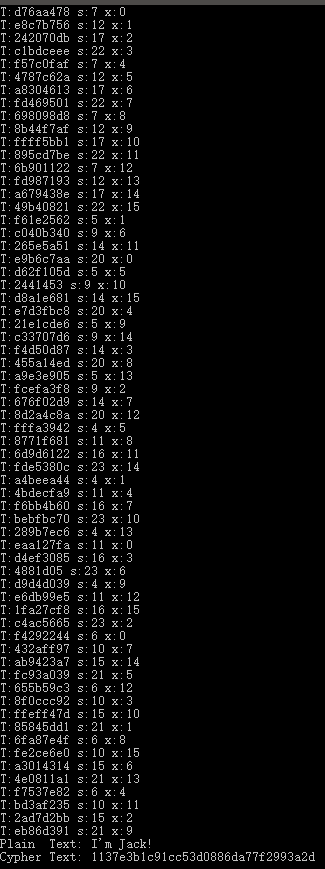
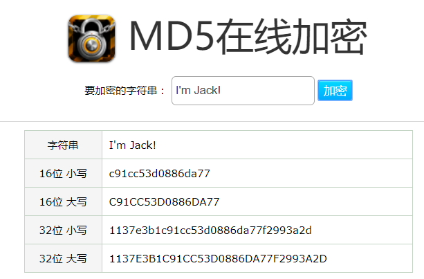

#<center>MD5 算法设计</center>
###<center>学号：15331087</center>
###<center>姓名：高俊杰</center>

##一、MD5密码保护
MD5因为它的低碰撞性，常用于数据压缩，尤其是对于密码的保护。因为它是不可逆的，明文密码加密后得到的密文无法推出原文，并且校验密码可以转为校验密码加密得到的MD5值，所以在数据库中只要存密码的MD5值，在需要校验的时候只需求出输入的MD5值并和数据库内容比较是否一致，既不泄露用户信息，又几乎不可能出错。

##二、MD5算法流程
1.处理输入字符串，在整串后面补充比特位"100...000"若干（必须至少补充一个位1），并在最后再补充额外的64位来表示字符串的长度。然后将之分割成L组长度为512的子串。

2.将上述的L个512bits长度的子串分别作一系列压缩，并且每步的结果会作为下一步的输入。

3.压缩过程又分为使用4个不同的函数F, G, H, I, 每个函数又分别迭代16次，故对于每一个输入的子串，都要进行64轮迭代。

4.每一个压缩函数每轮都会输入A,B,C,D四个32位的数，这四个数还需要另外保存在长度为128的串CV中。这四个数拥有固定的初始值。变量T作为另一个输入，它与迭代的轮数有关。还有一个输入的变量是S，这个可以查表得到。至于输入的那个512位的子串，它会先被区分为16个32位的串，表示成长度16的unsigned int大小的数组，然后根据轮数i查一个名为X的表，找出对应的数作为下标，从长度为16的数组中取出对应下标的元素作为压缩函数的最后一个输入变量。

5.每一轮压缩后得到新的A,B,C,D输出，加进CV中，再以D,A,B,C的顺序作为下一轮的输入。

6.迭代最后，每一个512位的子串都会得到最终的由各轮迭代产生的A,B,C,D相加得到的128位长的CV中。这就是最终我们所需的MD5值。


##三、C语言源代码

MD5.c :

MD5函数可供直接调用，传入两个指针，前者最终指向MD5值，后者则是需要压缩的字符串。

F,G,H,I函数分别为四个轮函数。

H_MD5函数为循环压缩函数。

最后main函数里测试MD5函数的运行情况。

```c
#include <memory.h>
#include <math.h>
#include <stdlib.h>
#include <stdio.h>
#include <string.h>

unsigned char PADDING[] = {
    128, 0, 0, 0, 0, 0, 0, 0, 0, 0, 0, 0, 0, 0, 0, 0, 
    0, 0, 0, 0, 0, 0, 0, 0, 0, 0, 0, 0, 0, 0, 0, 0, 
    0, 0, 0, 0, 0, 0, 0, 0, 0, 0, 0, 0, 0, 0, 0, 0, 
    0, 0, 0, 0, 0, 0, 0, 0, 0, 0, 0, 0, 0, 0, 0, 0
};

unsigned int F(unsigned int A, unsigned int B, unsigned int C, unsigned int D, unsigned int X, unsigned int T, unsigned int S) {
    A += ((B & C) | (~B & D));
    A += X + T;
    A = ((A << S) | (A >> (32 - S)));
    A += B;
    return A;
}

unsigned int G(unsigned int A, unsigned int B, unsigned int C, unsigned int D, unsigned int X, unsigned int T, unsigned int S) {
    A += ((B & D) | (C & ~D));
    A += X + T;
    A = ((A << S) | (A >> (32 - S)));
    A += B;
    return A;
}

unsigned int H(unsigned int A, unsigned int B, unsigned int C, unsigned int D, unsigned int X, unsigned int T, unsigned int S) {
    A += (B ^ C ^ D);
    A += X + T;
    A = ((A << S) | (A >> (32 - S)));
    A += B;
    return A;
}

unsigned int I(unsigned int A, unsigned int B, unsigned int C, unsigned int D, unsigned int X, unsigned int T, unsigned int S) {
    A += (C ^ (B | ~D));
    A += X + T;
    A = ((A << S) | (A >> (32 - S)));
    A += B;
    return A;
}

void H_MD5(unsigned int CV[4], unsigned char input[64]) {
    unsigned int a = CV[0];
    unsigned int b = CV[1];
    unsigned int c = CV[2];
    unsigned int d = CV[3];
    
    int S[64] = {
        7, 12, 17, 22, 7, 12, 17, 22, 7, 12, 17, 22, 7, 12, 17, 22,
        5,  9, 14, 20, 5,  9, 14, 20, 5,  9, 14, 20, 5,  9, 14, 20,
        4, 11, 16, 23, 4, 11, 16, 23, 4, 11, 16, 23, 4, 11, 16, 23,
        6, 10, 15, 21, 6, 10, 15, 21, 6, 10, 15, 21, 6, 10, 15, 21
    };
    unsigned int *  indexes = (unsigned int *)input;
    unsigned int X[64] = {
        0, 1,  2,  3,  4,  5,  6,  7,  8,  9, 10, 11, 12, 13, 14, 15,
        1, 6, 11,  0,  5, 10, 15,  4,  9, 14,  3,  8, 13,  2,  7, 12,
        5, 8, 11, 14,  1,  4,  7, 10, 13,  0,  3,  6,  9, 12, 15,  2,
        0, 7, 14,  5, 12,  3, 10,  1,  8, 15,  6, 13,  4, 11,  2,  9
    };
    int i;
    for (i = 0; i < 16; i++) {
        unsigned int T = pow(2, 32) * fabs(sin(i + 1));//printf("T:%x s:%d x:%d\n", T, S[i], X[i]);
        a = F(a, b, c, d, indexes[X[i]], T, S[i]);
        int tmp = d;
        d = c;
        c = b;
        b = a;
        a = tmp;
    }
    for (i = 16; i < 32; i++) {
        unsigned int T = pow(2, 32) * fabs(sin(i + 1));//printf("T:%x s:%d x:%d\n", T, S[i], X[i]);
        a = G(a, b, c, d, indexes[X[i]], T, S[i]);
        int tmp = d;
        d = c;
        c = b;
        b = a;
        a = tmp;
    }
    for (i = 32; i < 48; i++) {
        unsigned int T = pow(2, 32) * fabs(sin(i + 1));//printf("T:%x s:%d x:%d\n", T, S[i], X[i]);
        a = H(a, b, c, d, indexes[X[i]], T, S[i]);
        int tmp = d;
        d = c;
        c = b;
        b = a;
        a = tmp;
    }
    for (i = 48; i < 64; i++) {
        unsigned int T = pow(2, 32) * fabs(sin(i + 1));//printf("T:%x s:%d x:%d\n", T, S[i], X[i]);
        a = I(a, b, c, d, indexes[X[i]], T, S[i]);
        int tmp = d;
        d = c;
        c = b;
        b = a;
        a = tmp;
    }
    CV[0] += a;
    CV[1] += b;
    CV[2] += c;
    CV[3] += d;
}

void MD5(unsigned char * cypher, unsigned char * plain) {
    unsigned int CV[4];
    unsigned int Buffer[16];
    CV[0] = 0x67452301;
    CV[1] = 0xEFCDAB89;
    CV[2] = 0x98BADCFE;
    CV[3] = 0x10325476;
    int i = 0;
    for (i = 0; i + 64 <= strlen(plain); i += 64) {
        H_MD5(CV, plain + i);
    }
    int end = i;
    memcpy((unsigned char*)Buffer, plain + end, strlen(plain) - end);

    if (strlen(plain) - end < 56) {
        memcpy((unsigned char*)Buffer + strlen(plain) - end, PADDING, 56 - (strlen(plain) - end));
    } else {
        memcpy((unsigned char*)Buffer + strlen(plain) - end, PADDING, 64 - (strlen(plain) - end));
        H_MD5(CV, (unsigned char *)Buffer);
        memcpy((unsigned char*)Buffer, PADDING + 8, 56);
    }
    unsigned long long length = strlen(plain) << 3;
    memcpy((unsigned char*)Buffer + 56, &length, 8);
    H_MD5(CV, (unsigned char *)Buffer);

    unsigned char * tmp = (unsigned char *)CV;
    for (i = 0; i < 16; i++) {
        cypher[i] = tmp[i];
    }
}

int main(int argc, char *argv[]) {
    unsigned char plain[] ="I'm Jack!";
    unsigned char cypher[16];//1137e3b1c91cc53d0886da77f2993a2d
    
    MD5(cypher, plain);
    printf("Plain  Text: %s\n", plain);
    printf("Cypher Text: ");
    int i;
    for(i = 0; i < 16; i++) {
        printf("%02x", cypher[i]);
    }
    return 0;
}

```

##四、算法运行情况
下图是运行的情况的截图以及打印的文本.

看到最下面两行的显示是"Plain  Text: I'm Jack!
Cypher Text: 1137e3b1c91cc53d0886da77f2993a2d"。



下面是使用网上MD5在线加密作为对比的截图，加密后的密文和我使用C语言编写的代码运行结果一致，说明MD5算法成功实现了。



>>T:d76aa478 s:7 x:0
T:e8c7b756 s:12 x:1
T:242070db s:17 x:2
T:c1bdceee s:22 x:3
T:f57c0faf s:7 x:4
T:4787c62a s:12 x:5
T:a8304613 s:17 x:6
T:fd469501 s:22 x:7
T:698098d8 s:7 x:8
T:8b44f7af s:12 x:9
T:ffff5bb1 s:17 x:10
T:895cd7be s:22 x:11
T:6b901122 s:7 x:12
T:fd987193 s:12 x:13
T:a679438e s:17 x:14
T:49b40821 s:22 x:15
T:f61e2562 s:5 x:1
T:c040b340 s:9 x:6
T:265e5a51 s:14 x:11
T:e9b6c7aa s:20 x:0
T:d62f105d s:5 x:5
T:2441453 s:9 x:10
T:d8a1e681 s:14 x:15
T:e7d3fbc8 s:20 x:4
T:21e1cde6 s:5 x:9
T:c33707d6 s:9 x:14
T:f4d50d87 s:14 x:3
T:455a14ed s:20 x:8
T:a9e3e905 s:5 x:13
T:fcefa3f8 s:9 x:2
T:676f02d9 s:14 x:7
T:8d2a4c8a s:20 x:12
T:fffa3942 s:4 x:5
T:8771f681 s:11 x:8
T:6d9d6122 s:16 x:11
T:fde5380c s:23 x:14
T:a4beea44 s:4 x:1
T:4bdecfa9 s:11 x:4
T:f6bb4b60 s:16 x:7
T:bebfbc70 s:23 x:10
T:289b7ec6 s:4 x:13
T:eaa127fa s:11 x:0
T:d4ef3085 s:16 x:3
T:4881d05 s:23 x:6
T:d9d4d039 s:4 x:9
T:e6db99e5 s:11 x:12
T:1fa27cf8 s:16 x:15
T:c4ac5665 s:23 x:2
T:f4292244 s:6 x:0
T:432aff97 s:10 x:7
T:ab9423a7 s:15 x:14
T:fc93a039 s:21 x:5
T:655b59c3 s:6 x:12
T:8f0ccc92 s:10 x:3
T:ffeff47d s:15 x:10
T:85845dd1 s:21 x:1
T:6fa87e4f s:6 x:8
T:fe2ce6e0 s:10 x:15
T:a3014314 s:15 x:6
T:4e0811a1 s:21 x:13
T:f7537e82 s:6 x:4
T:bd3af235 s:10 x:11
T:2ad7d2bb s:15 x:2
T:eb86d391 s:21 x:9
Plain  Text: I'm Jack!
Cypher Text: 1137e3b1c91cc53d0886da77f2993a2d